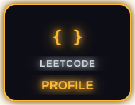
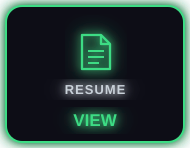
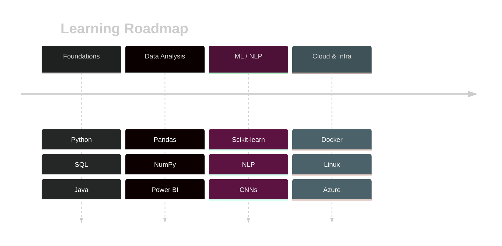

<div align="center">


<a href="https://git.io/typing-svg">
  
</a>


<br/><br/>

<p>

</p>

<p>
<a href="https://www.linkedin.com/in/md-aftab-uddin/"></a><a href="mailto:aftabuddin.mhd@gmail.com"></a><a href="https://leetcode.com/aftabcoder"></a><a href="https://instagram.com/always_aaftab"></a><a href="https://drive.google.com/file/d/1t2ih4FFAd9-aqdLKbFPv7OOAnLyYzruK/view?usp=drive_link"></a>
</p>

<sub>✅ Views, Followers &amp; Public Repos are fetched live from the GitHub API — no fabricated data.</sub>

</div>

---


### 🧑‍💻 About Me

```yaml
name: Md Aftab Uddin
role: Data Engineering Trainee @ EPAM Systems
education: B.Tech Computer Science (Data Science), Haldia Institute of Technology (Graduated)
focus: [Data Engineering, Machine Learning, NLP, Computer Vision]
currently_learning: [Azure Cloud, Docker, Linux, Power BI, Advanced Python]
volunteering: Teacher @ Samarpan Society NGO (tuition in Bengali)
fun_fact: "I'm an overthinker who pays great attention to detail 🔍"
```

<table>
<tr>
<td width="60%" valign="top">

- 🔭 Building end-to-end **ML pipelines** and real-world data analysis workflows
- ☁️ Studying for an **Azure cloud certification** — SQL Managed Instance, cost models, and more
- 🐧 Growing foundational skills in **Linux** and **Docker**
- 🌱 Currently deepening knowledge of **NLP, CNNs, and Power BI**
- 🤝 Open to collaborating on data engineering & ML projects
- 💬 Ask me about Python, SQL, data pipelines, or NLP/CV projects

</td>
<td width="40%" valign="top" align="center">



</td>
</tr>
</table>

---

### 🚀 Featured Projects

<details open>
<summary><b>🖼️ EdgeAwareNet — CNN Edge-Aware Image Filtering</b></summary>
<br/>

B.Tech final-year project: a CNN-based deep edge-aware image filtering system trained on the GoPro dataset, with a full project presentation built using `pptxgenjs`.

`Python` `PyTorch` `CNN` `Computer Vision`
</details>

<details>
<summary><b>💬 Twitter Sentiment Analysis</b></summary>
<br/>

NLP sentiment classifier built during a Final Year Internship at Euphoria GenX, documented in a formatted `.docx` report. **ExtraTreesClassifier** was the best-performing model. A later self-review identified data leakage, missing text preprocessing, and suboptimal TF-IDF configuration — with transformer-based models recommended as the next step.

`Python` `NLP` `Scikit-learn` `TF-IDF`
</details>

<details>
<summary><b>🧩 ProfileCraft</b></summary>
<br/>

A single-file HTML portal that generates professional company profile summaries using the Claude API, tailored to a data-engineering context.

`HTML` `Claude API` `Prompt Engineering`
</details>

<details>
<summary><b>🗄️ Full-Stack Database Projects</b></summary>
<br/>

Two projects exploring how frontend interfaces connect to database backends: one built with **Gradio + PostgreSQL**, the other with **FastAPI + plain HTML/JS**, with a focus on event-handler wiring and `fetch()` API patterns.

`Python` `FastAPI` `Gradio` `PostgreSQL`
</details>

<details>
<summary><b>📊 SQL Window Functions Practice</b></summary>
<br/>

A progressively complex series of PostgreSQL exercises on the Oracle SH schema — `RANK()`, `SUM() OVER()`, `LAG()`, `CUME_DIST()`, and multi-year comparative reporting, including a two-stage filtering pattern for year-over-year comparisons.

`PostgreSQL` `SQL` `Window Functions`
</details>

<br/>

<div align="center">
📌 <a href="https://github.com/AftabQuant/Machine-Learning-Project.git">Data Science Project</a> &nbsp;·&nbsp;
<a href="https://github.com/AftabQuant/Data-Analysis-Project">Data Analysis & ML Projects</a>
</div>

---

### 🧰 Tech Stack

<div align="center">


</div>

<br/>

<div align="center">

| Category | Tools |
|---|---|
| **Languages** | Python, Java, C, SQL |
| **Data & ML** | Pandas, NumPy, Scikit-learn, PyTorch, Seaborn |
| **Data Engineering** | PostgreSQL, MySQL, MongoDB, FastAPI |
| **Cloud & DevOps** | Azure, Docker, Linux, Git |
| **Visualization** | Power BI, Matplotlib, Seaborn |

</div>

---

### 📊 GitHub Stats & Push History

<div align="center">


</div>

> ℹ️ Every widget above is a **live badge pulled from the GitHub API** — your real commit/push history, streaks, and language stats are untouched and update automatically.

#### 🐍 Contribution Snake

Add the included `.github/workflows/snake.yml` to your repo (already generated for you below) to get an animated snake that "eats" your contribution graph. Once the workflow runs once, this line will render it:

<div align="center">

</div>

---

### 🏆 Trophies & Achievements

<div align="center">

</div>

---

### 🧮 LeetCode Progress

<div align="center">

</div>

---

### 💡 Dev Quote of the Day

<div align="center">

</div>

---

### 🌐 Connect With Me

<p align="center">
<a href="https://www.linkedin.com/in/md-aftab-uddin/" target="blank"></a>
<a href="https://instagram.com/always_aaftab" target="blank"></a>
<a href="https://www.leetcode.com/aftabcoder" target="blank"></a>
<a href="mailto:aftabuddin.mhd@gmail.com" target="blank"></a>
</p>

<div align="center">
<sub>⚡ Thanks for stopping by — explore my repositories or reach out to collaborate on a data project! ⚡</sub>
</div>

